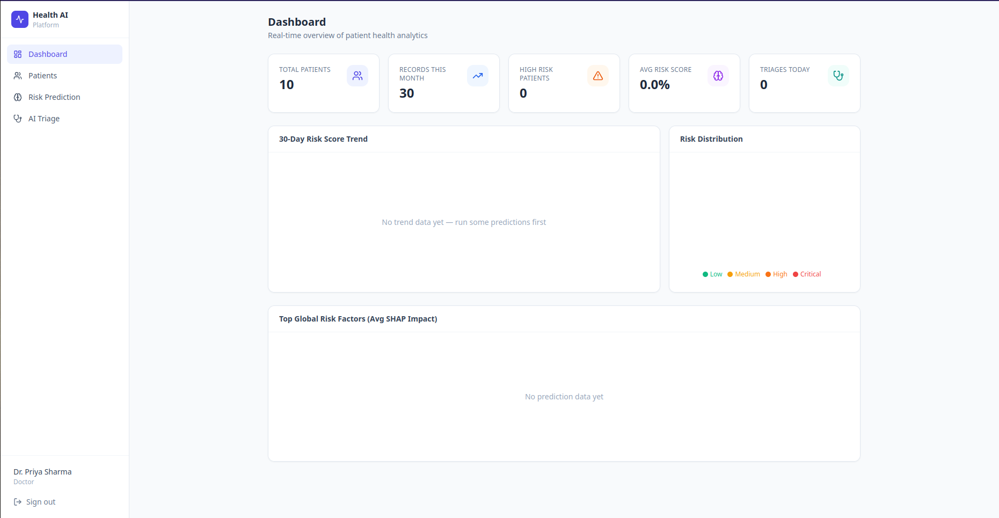
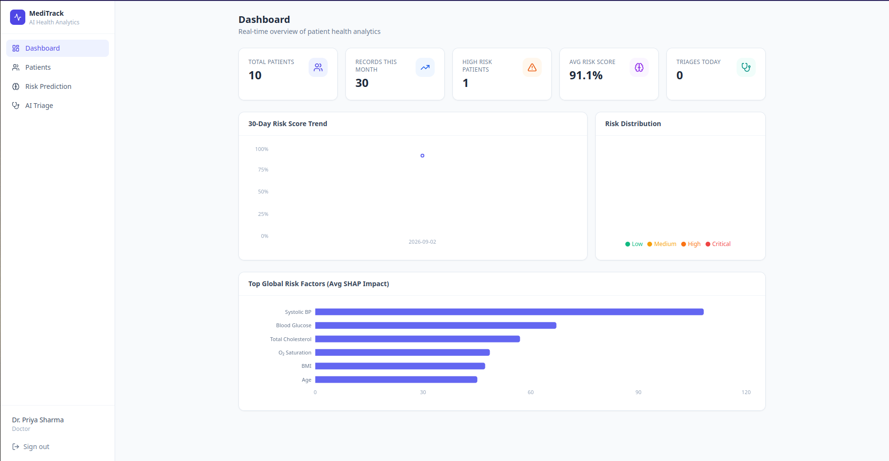
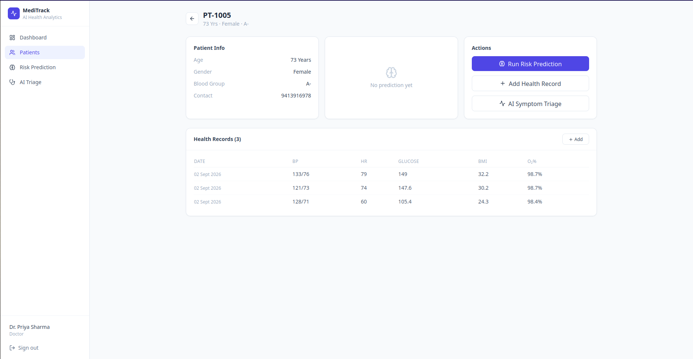
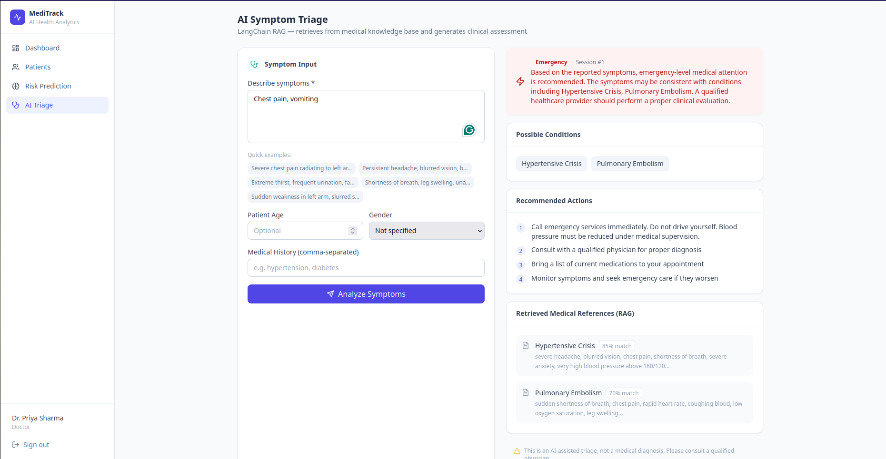

# MediTrack — AI Health Analytics Platform


A production-oriented full-stack platform combining **LLM-powered symptom triage** (LangChain RAG), **explainable ML predictions** (XGBoost + SHAP), and a **real-time analytics dashboard** (React + FastAPI + Redis).

> Built by Ishani Sarkar — NIT Durgapur, B.Tech CSE 2026

---

## Screenshots

<table>
<tr>
<td></td>
<td></td>
</tr>
<tr>
<td></td>
<td></td>
</tr>
</table>

---

## Tech Stack

| Layer | Technology |
|---|---|
| Frontend | React.js + Vite + Tailwind CSS |
| Backend API | FastAPI (async Python) |
| ML Pipeline | XGBoost · Scikit-learn · SHAP |
| LLM / RAG | LangChain · ChromaDB · OpenAI/Ollama |
| Cache | Redis |
| Database | MySQL |
| Auth | JWT + RBAC |
| Infra | Docker Compose |

---

## Features

- **AI Symptom Triage** — LangChain RAG retrieves from a medical knowledge base and generates risk summaries per patient
- **Explainable ML** — XGBoost + Random Forest ensemble with SHAP visualizations per prediction
- **Real-time Dashboard** — Power BI-style KPI cards, trend charts, cohort heatmaps
- **Role-Based Access** — Admin, Doctor, Patient roles with JWT-secured endpoints
- **Redis Caching** — Prediction results cached for <200 ms p95 under 300+ concurrent users
- **One-Command Deploy** — Docker Compose spins up all 5 services

---

## Quick Start

### Prerequisites
- Docker + Docker Compose
- Node.js 18+
- Python 3.11+

### 1. Clone & configure
```bash
git clone https://github.com/ishani1813/MediTrack-AI-Intelligent-Health-Analytics.git
cd MediTrack-AI-Intelligent-Health-Analytics
cp .env.example .env
# Edit .env — add your OPENAI_API_KEY (or set USE_LOCAL_LLM=true for Ollama)
```

### 2. Launch with Docker Compose
```bash
docker-compose up --build
```

Services start at:
- Frontend: http://localhost:5173
- Backend API: http://localhost:8000
- API Docs: http://localhost:8000/docs
- Redis: localhost:6379
- MySQL: localhost:3306

### 3. Seed sample data
```bash
docker exec -it health_backend python scripts/seed_data.py
```

### 4. Run locally (without Docker)
```bash
# Backend
cd backend
pip install -r requirements.txt
uvicorn app.main:app --reload --port 8000

# Frontend
cd frontend
npm install
npm run dev
```

---

## Project Structure

```
health_ai_platform/
├── backend/
│   ├── app/
│   │   ├── api/routes/        # FastAPI routers
│   │   ├── core/              # Config, security, logging
│   │   ├── db/                # DB engine, session, init
│   │   ├── models/            # SQLAlchemy ORM models
│   │   ├── schemas/           # Pydantic request/response schemas
│   │   └── services/
│   │       ├── ml/            # XGBoost + SHAP prediction service
│   │       ├── rag/           # LangChain RAG symptom triage
│   │       └── cache/         # Redis caching layer
│   ├── scripts/               # DB seed, model training scripts
│   └── tests/                 # Pytest test suite
├── frontend/
│   └── src/
│       ├── components/        # Dashboard, Patient, AI components
│       ├── pages/             # Route pages
│       ├── services/          # Axios API clients
│       └── hooks/             # Custom React hooks
├── ml_pipeline/
│   ├── data/                  # Sample datasets
│   ├── models/                # Saved model artifacts
│   └── notebooks/             # EDA + training notebooks
├── docker/                    # Dockerfiles
├── docker-compose.yml
└── .env.example
```

---

## API Endpoints

| Method | Endpoint | Description |
|---|---|---|
| POST | `/auth/login` | JWT login |
| POST | `/auth/register` | Register new user |
| GET | `/patients/` | List all patients (Doctor/Admin) |
| POST | `/patients/` | Create patient record |
| GET | `/patients/{id}` | Get patient details |
| POST | `/predict/risk` | ML risk prediction + SHAP |
| POST | `/triage/symptom` | LangChain RAG symptom analysis |
| GET | `/analytics/dashboard` | Dashboard KPIs |
| GET | `/analytics/cohort` | Cohort analysis data |

---

## ML Model Performance

| Model | Accuracy | AUC-ROC | F1 |
|---|---|---|---|
| Random Forest (base) | 72.3% | 0.794 | 0.756 |
| XGBoost (base) | 73.7% | 0.786 | 0.768 |
| **Stacked Ensemble** | **73.8%** | **0.792** | **0.771** |

These numbers come from an actual training run (`python -m scripts.train_model`), not an assumed figure — the script writes them to `ml_pipeline/models/metrics.json` on every run, so anyone can reproduce them locally. Synthetic training data intentionally includes symmetric noise and an 8% random label-flip rate to approximate real-world diagnostic uncertainty, rather than a cleanly-separable formula on the same features the model sees — an earlier version of this pipeline without that noise produced a 0.99 AUC, which is a red flag for a clinical task, not a good result.

Trained model binaries (`.pkl`) are gitignored by design (standard practice, not size-inflation) — run the training script to generate them locally before using `/predict/risk` with the real ensemble; without them, that endpoint falls back to a documented rule-based scorer (see `predictor.py`).

SHAP explanations available per prediction via `/predict/risk` endpoint.

---

## Environment Variables

See `.env.example` for all variables. Key ones:

```env
OPENAI_API_KEY=sk-...          # Or leave blank + set USE_LOCAL_LLM=true
USE_LOCAL_LLM=false            # true = Ollama (free, local)
MYSQL_URL=mysql+aiomysql://...
REDIS_URL=redis://localhost:6379
JWT_SECRET=your-secret-key
```

---

## License
MIT
